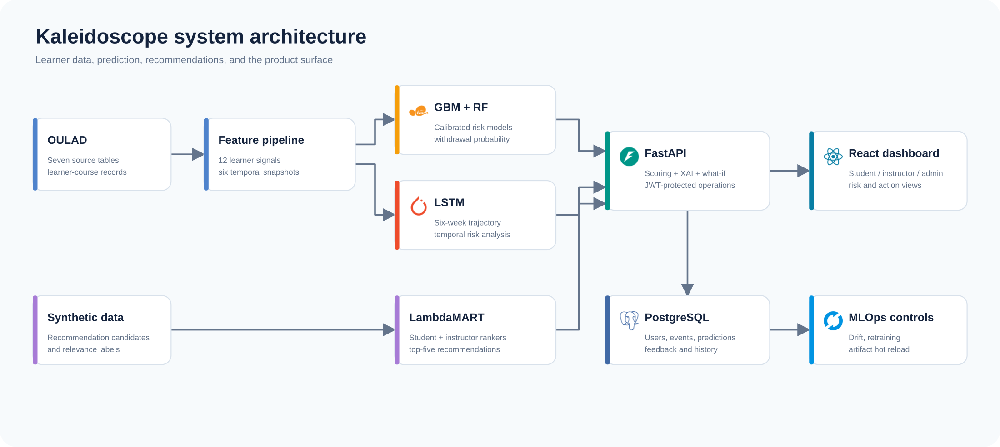
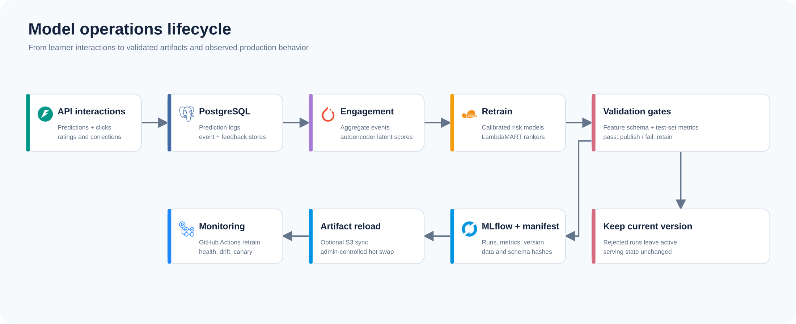

# Kaleidoscope

**Explainable learning analytics, recommendations, and model operations for education.**

We built Kaleidoscope to estimate a learner's withdrawal risk from Open University Learning Analytics Dataset (OULAD) activity and give students and instructors ways to inspect the score and act on it. Our system combines calibrated tabular models, a temporal model, explainability methods, two learning-to-rank recommenders, and a FastAPI application with role-based React views.

[Explore the ML pipeline](#machine-learning) · [Inspect the MLOps loop](#mlops) · [Run locally](#run-locally) · [Browse the API](#backend-and-api)

## System at a glance



[Edit the architecture diagram in draw.io](docs/diagrams/system-architecture.drawio)

The primary model predicts withdrawal risk. SHAP attributions, anchor rules, similar-learner examples, DiCE counterfactuals, and a causal annotation layer give the UI different views of that result. A Monte Carlo simulator samples observed week-to-week feature changes to show a distribution of possible outcomes. Optional Groq narration summarizes computed explanation fields for each audience.

## Measured results

The checked-in [training summary](models/training_summary.json) reports these held-out metrics. The [model manifest](models/model_manifest.json) identifies the current artifact as `gbm-v3`:

| Withdrawal-risk model | ROC AUC ↑ | Average precision ↑ | F1 ↑ | Brier score ↓ |
| --- | ---: | ---: | ---: | ---: |
| Calibrated gradient boosting | 0.9363 | 0.8224 | **0.7848** | **0.0912** |
| Calibrated random forest | **0.9381** | **0.8286** | 0.7690 | 0.0942 |

The [recommendation training summary](models/recommenders/recommendation_training_summary.json) reports NDCG@3 of **0.8090** for student recommendations and **0.9926** for instructor recommendations. Those rankers use generated recommendation datasets, so these numbers describe the synthetic evaluation task; they do not establish effectiveness in a live course. The withdrawal target comes from OULAD's `Withdrawn` outcome. See [the model comparison report](files/MODEL_COMPARISON.md) for earlier baseline and LSTM experiments; the table above reflects the current checked-in summary.

## Machine learning

**Risk prediction.** [The data loader](backend/app/model/data_loader.py) joins seven OULAD tables at the student, module, and presentation level. It creates 12 behavioral and progress features, including login frequency, assessment performance, missed deadlines, and days since activity. Some fields use documented proxies: for example, the pipeline estimates session duration from VLE clicks. It labels `Withdrawn` records as positive and writes a stratified 80/20 train/test split. The included feature table has **32,593 learner-course records**.

[The trainer](backend/app/model/trainer.py) fits scikit-learn gradient boosting and random forest classifiers, calibrates their probabilities, records ROC AUC, average precision, F1, and Brier score in MLflow, and saves model artifacts. Gradient boosting serves the default `/predict` path; the random forest supports comparison. [The temporal pipeline](backend/app/model/temporal_builder.py) builds cumulative snapshots at weeks 2, 4, 6, 8, 10, and 12. A [PyTorch LSTM](backend/app/model/lstm_trainer.py) consumes those six-step sequences for temporal risk analysis.

**Explanations and interventions.** The API combines TreeSHAP feature contributions, SHAP interactions, anchor rules, prototype learners, and DiCE counterfactuals. It also exposes what-if scoring, a trust score, uncertainty estimates, and causal annotations. These methods answer different questions: which inputs drove a score, which nearby examples resemble the learner, and which permitted changes could shift the prediction. Causal annotations depend on the assumptions in the project's causal graph; treat them as model-based estimates.

**Recommendations.** [Two LightGBM LambdaMART rankers](backend/app/recommender/train_recommenders.py) order student-facing learning actions and instructor-facing intervention candidates. Training splits by query identity, evaluates NDCG/recall/MAP at three, and writes top-five lookup tables. The checked-in [generation report](data/synthetic/recommendations/generation_report.json) identifies the recommendation training data as synthetic.

## MLOps



[Edit the MLOps diagram in draw.io](docs/diagrams/mlops-lifecycle.drawio). Service icons come from [Simple Icons](https://simpleicons.org/).

The [retraining pipeline](backend/app/model/retrain_pipeline.py) aggregates interaction events, trains an engagement autoencoder, adds three latent engagement signals, and retrains the risk models. It checks feature shape and held-out metric regressions before saving artifacts. The manifest records model version, feature-schema hash, data fingerprint, and a metric snapshot. [Hot reload](backend/app/model/hot_reload.py) stages models and dependent explainers before swapping live state; `/mlops/reload` also accepts a canary traffic fraction for risk predictions. The full retrain and reload endpoints include the recommendation rankers.

MLflow tracks training and retraining runs. `/mlops/health`, `/mlops/metrics`, and `/mlops/drift-report` expose model state, saved metrics, and input drift from logged predictions. MLOps control endpoints require an admin session or `X-MLOPS-Token`. [GitHub Actions](.github/workflows/) contains lint/test, image deployment, infrastructure, and scheduled retraining workflows; [Terraform](infra/) defines the AWS deployment resources. S3 artifact transfer runs when `AWS_S3_BUCKET` is configured.

## Backend and API

[FastAPI](backend/app/main.py) loads available model artifacts at startup and serves predictions, explanations, recommendations, account flows, and monitoring endpoints. SQLAlchemy stores users, learner snapshots, prediction logs, explanations, events, and feedback in PostgreSQL when `DATABASE_URL` is set; local development falls back to SQLite files under `data/`. JWT authentication separates student, instructor, and admin views. The [React frontend](frontend/src/App.jsx) exposes dashboards, model comparison, intervention plans, simulation, and explanation history.

| Area | Representative endpoints |
| --- | --- |
| Risk and explanation | `POST /predict`, `POST /explain`, `POST /whatif`, `POST /simulate` |
| Recommendations | `POST /recommend/student`, `POST /recommend/instructor`, explanation and what-if variants |
| Learning loop | `POST /events`, `POST /feedback`, `POST /mlops/retrain-all`, `POST /mlops/reload-all` |
| Operations | `GET /health`, `GET /mlops/health`, `GET /mlops/metrics`, `GET /mlops/drift-report` |

Open `/docs` after starting the API for request schemas and the complete route list.

## Run locally

Use **Python 3.11** and **Node.js 20**. The repository includes model and data artifacts for local exploration. From the project root:

```bash
python3.11 -m venv .venv
source .venv/bin/activate
pip install -r requirements.txt
export JWT_SECRET_KEY="$(openssl rand -hex 32)"
uvicorn backend.app.main:app --reload
```

In another terminal:

```bash
cd frontend
npm ci
npm run dev
```

Open the Vite URL shown in the terminal (normally `http://localhost:5173`). The UI proxies `/api` calls to FastAPI at `http://localhost:8000`; API documentation lives at `http://localhost:8000/docs`. Set `GROQ_API_KEY` if you want LLM narration. Without `DATABASE_URL`, the backend creates local SQLite stores.

For an API plus PostgreSQL stack, set `JWT_SECRET_KEY` in your shell and run `docker compose up --build`. The current Docker image contains the backend but no built React bundle. Run Vite as above for the UI. The container mounts `models/` read-only; routes that need the training or temporal data require those artifacts inside the container as well. Use the local Python path for retraining.

To rebuild the ML artifacts from the raw OULAD files:

```bash
python backend/app/model/data_loader.py
python backend/app/model/temporal_builder.py
python backend/app/model/trainer.py
python backend/app/model/lstm_trainer.py
python backend/app/recommender/train_recommenders.py
```

The data loader uses `data/raw/` when the seven CSV files are present and can download OULAD when they are absent. The repository includes synthetic recommendation CSVs. To regenerate them, set `GROQ_API_KEY` and run `python scripts/generate_synthetic_recommendation_data.py` before training the rankers. Training writes artifacts under `models/`; MLflow uses `mlruns/` unless you set `MLFLOW_TRACKING_URI`. Install `pytest` and run `python -m pytest tests/` for backend checks. Run `npm run build` in `frontend/` to verify the UI build.
